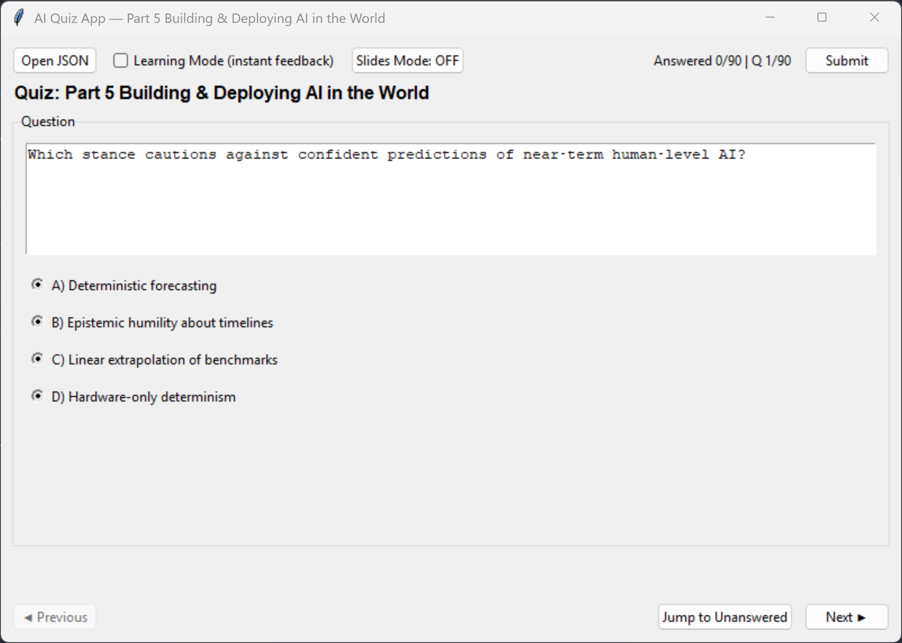

# AI Quiz App

A lightweight desktop app for practicing multiple‑choice questions (MCQs) based on **_Artificial Intelligence: A Guide for Thinking Humans_**.  
Built with **Python + Tkinter**, bundled for Windows via GitHub Actions, and compatible with macOS/Linux when run from source.


## 🚀 Latest Release

[AI Quiz App v1.4](https://github.com/jentimanatol/quiz_app/releases/tag/v1.4) is now available 

[AI Quiz App v1.3](https://github.com/jentimanatol/quiz_app/releases/tag/v1.3) 
[AI Quiz App v1.2](https://github.com/jentimanatol/quiz_app/releases/tag/v1.2) 
## ✨ Features

- **Open JSON**: Load any quiz set that matches the simple schema below.
- **Quiz title from filename**: The app title and a bold label show which quiz you have open.
- **Learning Mode**: After you choose an option, your selection is graded immediately:  
  - ✅ Correct choice turns **green**  
  - ❌ Wrong choice turns **red** and the correct choice turns **green**
- **Slides Mode**: Toggle to display the **Answer** line under each question (great for teaching/demos).
- **Navigation**: Previous / Next and **Jump to Unanswered**.
- **Submit**: Calculates your score with a per‑question breakdown and lets you **save results** to a text file.
- **No external deps**: Only standard library + Tkinter (ships with most Python installs).

---

## 📦 Download (Windows)

Grab the latest **`AIQuizApp_<version>.exe`** or the **ZIP** from the **Releases** page.  
No install required—just run the EXE and open a quiz JSON.


## 📄 Quiz JSON Schema

Each item has **one question**, **four options**, and a **single-letter** correct answer.

```json
[
  {
    "question": "What is deep learning?",
    "options": [
      "A) A type of ML that uses hierarchical representations",
      "B) A type of ML that uses shallow neural networks",
      "C) A type of ML that uses linear models",
      "D) A type of ML that uses decision trees"
    ],
    "answer": "A"
  }
]
```
## 🖼️ Screenshot



---

## 📜 License & Attribution

- Code: choose a permissive license (e.g., MIT).  
- Content (MCQs): pick an appropriate content license (e.g., CC BY‑NC).  
- The book credit is for context only; these are original study questions.

---


Happy studying! 🎓🤖

_Not protected by copyright, may be used for its intended purpose._  
_Author: Anatolie Jentimir._
